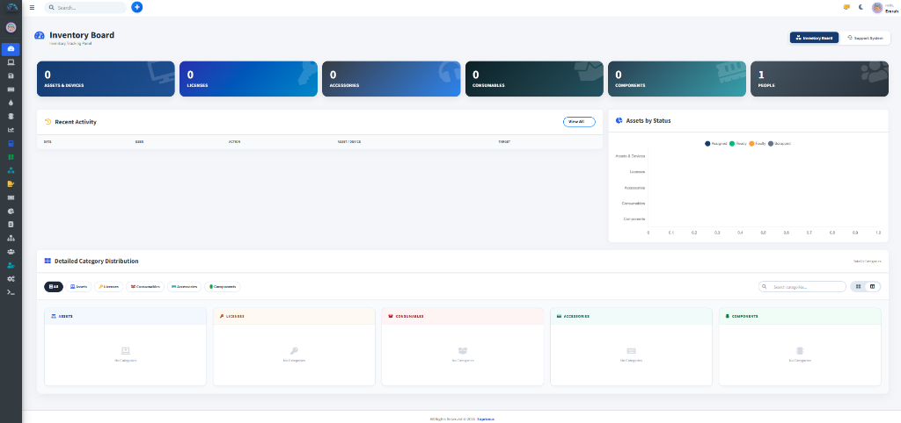
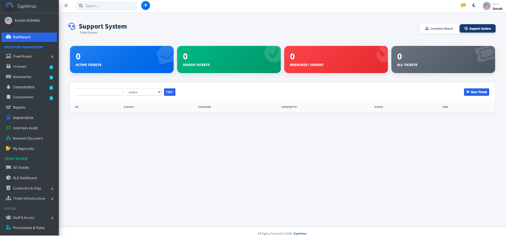

# Eaprimus - Ticketing & Asset Management System

<p align="center">
  
</p>

Eaprimus is a modern, secure, and web-based management system designed to streamline your business needs by integrating **Helpdesk / Ticketing** and **Asset / Inventory Management** in a single platform.

It allows IT, customer support, and administrative departments to manage incoming requests while maintaining audit-ready assignment and return logs for company assets (hardware, licenses, components, consumables).

### 🖥️ Dashboard & UI Preview

| System Dashboard | Asset & Ticket List |
|---|---|
|  |  |

---

[Türkçe Açıklama İçin Tıklayın / Click Here for Turkish Description](#tr-turkce-aciklama)

---

## 🚀 Key Features

- **Advanced Ticketing & Helpdesk:** Seamless request management between customers, agents, and administrators.
- **Asset & Inventory Tracking:** Maintain accurate tracking of Hardware (PCs, Monitors, etc.), Licenses, Components, and Consumables.
- **Automated Handover Forms & PDF Export:** Generate hand-signed or digitally signed assignment and return forms dynamically in PDF format.
- **Advanced Notification Engine:** Automated Email and Telegram alerts on new tickets or asset assignments.
- **Email-to-Ticket Integration (IMAP):** Automatically convert incoming support emails into ticket requests.
- **Automated Background Workers (Cron):** Intelligent CLI workers running in the background to enforce SLAs, process incoming emails, and dispatch notification queues.
- **Secure & Highly Scalable:** Built with SQL Injection protection (PDO Prepared Statements) and Bootstrap-styled pagination (limit/offset) for high performance on large datasets.

---

## 🛠️ System Requirements

To run Eaprimus smoothly, your server must meet the following requirements:

- **PHP:** >= 8.2 (Recommended)
- **Database:** MySQL or MariaDB
- **PHP Extensions:**
  - `PDO MySQL` (For database communication)
  - `GD` (For logo and image processing)
  - `cURL` (For external integrations and API calls)
  - `MBString` (For multi-language support)
  - `IMAP` (For converting emails to tickets)

---

## ⚙️ Installation Guide

You can install Eaprimus using either the Automatic Terminal Script or manually.

### Option 1: Automatic Installation (Recommended for Linux VPS/VDS)
If you are using a clean AlmaLinux, Rocky Linux, CentOS, Ubuntu, or Debian server, you can install the entire system (including Web Server, Database, Firewall, and Cron) with a single command. Connect to your server via SSH and run:

```bash
curl -sL https://raw.githubusercontent.com/emrahaksakal/Eaprimus/main/server-install.sh | sudo bash
```
*The script will prompt you to choose Nginx or Apache, setup MariaDB, configure your database credentials, and set up SELinux policies automatically.*

### Option 2: Manual Installation (For cPanel, Plesk, Shared Hosting, Windows)
If you cannot use the terminal script or are on a shared hosting environment, follow these steps:

#### 1. Upload Files
- Upload all repository files to your web server's root directory (e.g., `www` or `public_html`).

#### 2. Prepare Database
- Create an empty MySQL/MariaDB database using phpMyAdmin or any other database management tool.

#### 3. Run the Installation Wizard
- Navigate to your server address in a browser (e.g., `http://YOUR_SERVER_IP/eaprimus/` or directly `http://YOUR_SERVER_IP/eaprimus/install/`).
- The system will automatically redirect you to the Installation Wizard (`/install`).
- Choose your language and follow the steps to enter database connection details, company profile, and setup the administrator account.

#### 4. Configure Background Tasks (Cron)
The installation wizard will attempt to configure this automatically. However, if you receive a warning on Step 6 that automatic installation failed, you must add it manually:

- **Windows Servers (AMPPS/IIS):** 
  Right-click `public/install/setup_windows_cron.bat` and select **"Run as Administrator"** to automatically register the background task. This runs completely silently in the background using `php-win.exe`.
  
- **Linux Servers (cPanel/Ubuntu):**
  Add the following command to your server crontab to execute every minute:
  ```bash
  * * * * * php /path/to/app/cron/worker.php
  ```

---

## 📂 Repository File Structure

- **`.gitignore` (Crucial):** Protects sensitive database credentials (`.env`), active user sessions (`sessions`), log files (`logs`), and uploaded files from being pushed to public repositories. **Do not delete.**
- **`nginx.conf.example`:** Router redirection template for Nginx web server users.

---

## 🗺️ Roadmap

### Completed Features (v6.0+)
- [x] Helpdesk / Ticketing System & SLA Engine
- [x] Asset & Inventory Management (Hardware, Licenses, Accessories, Consumables, Components)
- [x] Automated Digital Handover Forms & PDF Export
- [x] Email-to-Ticket (IMAP) Conversion & Auto-Replies
- [x] Windows & Linux Native Background Worker Support (Cron)
- [x] REST API v1 Integration & Device Agent Key Authentication
- [x] Dynamic RBAC Role Permissions & Tab Level Controls
- [x] 📢 **Announcements & Notifications:** System-wide IT announcements, modal popups, and department-based targeting.
- [x] 🤖 **Remote Agent Auto-Update:** One-click remote update deployment for Windows & Linux device agents.

### Upcoming Features & Future Releases
- [ ] 🔔 **Expiry & Warranty Alert Engine:** Scheduled email alerts for expiring warranties and software licenses.
- [ ] 🏷️ **Bulk QR & Barcode Sheet Printing:** Multi-select assets for A4 grid PDF label printing.
- [ ] 🛠️ **Service & Repair Maintenance Log:** External vendor repair cost tracking and RMA management.
- [ ] 🌐 **Offline Agent Detection:** Alert IT admins when active device agents miss heartbeats over 7 days.

---

## 📝 License

This project is developed under **Eaprimus**. All rights reserved.

---
---

<a name="tr-turkce-aciklama"></a>

# TR: Eaprimus - Destek Talebi & Envanter Yönetim Sistemi

<p align="center">
  
</p>

Eaprimus, kurumsal ihtiyaçlarınız için geliştirilmiş, **Destek Talebi (Ticket) Yönetimi** ile **Varlık ve Envanter Takip** süreçlerini bir arada sunan modern, güvenli ve web tabanlı bir yönetim sistemidir.

Sistem; bilgi işlem, müşteri ilişkileri, idari işler gibi departmanların gelen talepleri yönetmesini ve şirket envanterlerinin (donanım, lisans, sarf malzeme vb.) zimmet kayıtlarını tutmasını sağlar.

### 🖥️ Arayüz Önizlemeleri

| Sistem Paneli (Dashboard) | Bilet ve Envanter Listesi |
|---|---|
|  |  |

---

## 🚀 Öne Çıkan Özellikler

- **Gelişmiş Bilet (Ticket) Yönetimi:** Müşteri ve personel arasında hızlı talep yönetimi.
- **Envanter ve Varlık Takibi:** Donanım (PC, Monitör vb.), Lisans, Bileşen ve Sarf Malzemesi takibi.
- **Otomatik Zimmet Formu ve PDF Çıktısı:** Teslimat ve iade işlemlerinde ıslak/dijital imza onaylı PDF teslim tutanağı oluşturma.
- **Gelişmiş Bildirim Altyapısı:** Yeni biletlerde veya zimmet atamalarında otomatik E-posta ve Telegram bildirimleri.
- **E-Posta ile Bilet Dönüştürme (IMAP):** Destek e-postalarını otomatik olarak sisteme bilet (ticket) olarak aktarma.
- **Arka Plan Görevleri (Cron):** SLA sürelerini denetleyen, e-postaları okuyan ve kuyruktaki bildirimleri gönderen akıllı işçi (worker) altyapısı.
- **Güvenli & Hızlı:** SQL Injection korumalı (PDO Prepared Statements) veri tabanı altyapısı ve yüksek veriler için sayfalama (pagination) desteği.

---

## 🛠️ Sistem Gereksinimleri

Sistemin kararlı çalışabilmesi için sunucunuzda aşağıdaki bileşenlerin yüklü olması gerekir:

- **PHP:** >= 8.2 (Önerilen)
- **Veritabanı:** MySQL veya MariaDB
- **PHP Eklentileri (Extensions):**
  - `PDO MySQL` (Veritabanı bağlantısı için)
  - `GD` (Logo ve resim işleme için)
  - `cURL` (Dış entegrasyonlar için)
  - `MBString` (Çoklu dil desteği için)
  - `IMAP` (E-posta ile talep oluşturma için)

---

## ⚙️ Kurulum Adımları

Sistemi sunucunuza Otomatik Script ile veya Manuel olarak kurabilirsiniz.

### Seçenek 1: Otomatik Kurulum (Linux VPS/VDS için Önerilir)
Eğer temiz bir AlmaLinux, Rocky Linux, CentOS, Ubuntu veya Debian sunucunuz varsa, tek bir komutla tüm sistemi (Web Sunucusu, Veritabanı, Güvenlik Duvarı ve Cron dahil) otomatik kurabilirsiniz. SSH ile sunucunuza bağlanın ve şu komutu çalıştırın:

```bash
curl -sL https://raw.githubusercontent.com/emrahaksakal/Eaprimus/main/server-install.sh | sudo bash
```
*Script size Nginx veya Apache seçimini soracak, MariaDB kurulumunu yapacak, veritabanı şifrenizi belirlemenizi isteyecek ve SELinux izinlerini otomatik ayarlayacaktır.*

### Seçenek 2: Manuel Kurulum (cPanel, Plesk, Paylaşımlı Hosting, Windows İçin)
Eğer terminal kullanamıyorsanız veya paylaşımlı hosting (cPanel vb.) kullanıyorsanız aşağıdaki adımları izleyin:

#### 1. Dosyaları Sunucuya Yükleme
- GitHub'dan indirdiğiniz tüm dosyaları web sunucunuzun kök dizinine (örneğin Apache için `www` veya `public_html`) kopyalayın.

#### 2. Veritabanı Hazırlama
- phpMyAdmin veya başka bir veritabanı yönetim aracından boş bir MySQL veritabanı oluşturun.

#### 3. Kurulum Sihirbazını Çalıştırma
- Tarayıcınızdan sunucu adresinize gidin (örneğin: `http://YOUR_SERVER_IP/eaprimus/` veya doğrudan `http://YOUR_SERVER_IP/eaprimus/install/`).
- Sistem otomatik olarak kurulum sihirbazına (`/install`) yönlendirilecektir.
- Dil seçiminizi yaptıktan sonra ekrandaki talimatları izleyerek veritabanı bağlantı bilgilerini, şirket adını ve yönetici (admin) hesabını tanımlayın.

#### 4. Arka Plan Görevlerini (Cron) Yapılandırma
Sistemin arka planda mail okuyabilmesi ve SLA sürelerini kontrol edebilmesi için bir Cron görevine ihtiyacı vardır. Kurulum sihirbazı bunu otomatik kurmaya çalışacaktır. **Ancak 6. adımda "Otomatik kurulum yapılamadı" uyarısı alırsanız**, görevi elle eklemeniz gerekir:

- **Windows Sunucular (AMPPS/IIS):** 
  `public/install/setup_windows_cron.bat` dosyasına sağ tıklayıp **"Yönetici Olarak Çalıştır"** diyerek görevi otomatik oluşturabilirsiniz. Bu görev `php-win.exe` ile arka planda tamamen sessiz çalışır.
  
- **Linux Sunucular (cPanel/Ubuntu):**
  Sunucu crontab dosyanıza (veya cPanel Cron İşleri bölümüne) her dakika çalışacak şekilde şu komutu ekleyin:
  ```bash
  * * * * * php /yol/app/cron/worker.php
  ```

---

## 📂 Dosya Yapısı Hakkında

- **`.gitignore` (Önemli):** Sunucudaki gizli veritabanı şifrelerinin (`.env`), oturumların (`sessions`), sistem loglarının (`logs`) ve yüklenen dosyaların GitHub'a yüklenmesini engelleyen güvenlik dosyasıdır. **Kesinlikle silinmemelidir.**
- **`nginx.conf.example`:** Eğer Apache yerine Nginx web sunucusu kullanıyorsanız, sitenizin yönlendirme ayarları için örnek bir konfigürasyon dosyasıdır. Nginx kullanıcıları için yararlıdır, **kalması önerilir.**

---

## 🗺️ Yol Haritası (Roadmap)

### Tamamlanan Özellikler (v6.0+)
- [x] Destek Talebi (Ticket) Yönetim Sistemi & SLA Süreçleri
- [x] Envanter & Varlık Takip Modülü (Cihaz, Lisans, Aksesuar, Sarf, Bileşen)
- [x] Otomatik Dijital İmza ve PDF Zimmet / İade Tutanakları
- [x] E-Posta ile Otomatik Bilet Oluşturma (IMAP) Entegrasyonu
- [x] Windows ve Linux Arka Plan Görev Desteği (Cron)
- [x] REST API Entegrasyonu & Cihaz Ajanı Anahtar Doğrulaması
- [x] Dinamik Rol & Sayfa/Sekme Yetkilendirmesi (RBAC)
- [x] 📢 **Sistem İçi Duyuru & Bildirim Yönetimi:** Toplu IT duyuruları, bölüm bazlı hedefleme ve okundu teyidi.
- [x] 🤖 **Merkezi Ajan Uzaktan Otomatik Güncelleme:** Sahadaki Windows ve Linux ajanlarını sunucudan tek tıkla güncelleme.

### Planlanan Gelecek Özellikler & Sürümler
- [ ] 🔔 **Garanti & Lisans Süresi Otomatik Uyarıları:** Dolmak üzere olan lisans ve garantiler için e-posta/bildirim uyarısı.
- [ ] 🏷️ **Toplu QR / Barkod Basım Şablonu:** Çoklu seçilen cihazları tek A4 etiket sayfasına grid şeklinde PDF bastırma.
- [ ] 🛠️ **Cihaz Bakım ve Servis Geçmişi Modülü:** Arızalanan cihazların yetkili servis ve tamir masraflarının takibi.
- [ ] 🌐 **Çevrimdışı (Pasif) Cihaz Takip & Uyarı Modülü:** 7 günden fazla veri göndermeyen ajanlı cihazlar için şüpheli/pasif uyarısı.

---

## 📝 Lisans

Bu proje **Eaprimus** bünyesinde geliştirilmiştir. Tüm hakları saklıdır.
